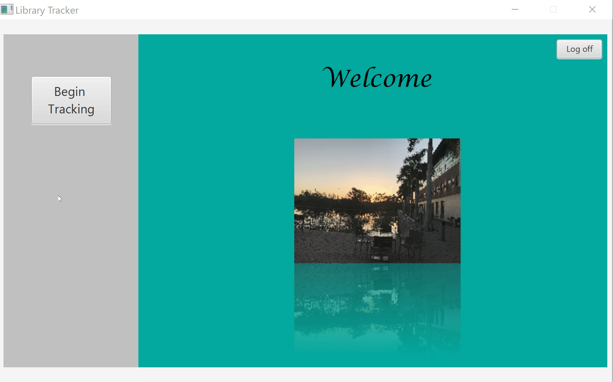

# DbPersonalProject

The DbPersonalProject is my personal program that incorporates a derby database, IntellJ IDEA IDE and my own creativity, in addition to
many, many sources and outside assistance. It uses Java and JavaFX, which is a facet of Java that uses fxml files for formatting a gui
and controller files to determine what objects in the gui do (such as actions that occur due to user input). This program was an 
individual assignment for my COP 3003 class during the Fall 2018 semester. 

This program uses the Google Java Style guide and adheres to the GUI Design Principles. There is contrast between the screen elements, groupings are present and not placed wildly, the screen elements and the groups are aligned (especially on the third scene), and the colors and graphics are effective and simple. There is clarity in the visual elements used, the functions of elements, and the words and text that are displayed. There is a consistency with my database program project in that each scene has a similar look, most of the button have simiplar usages, almost all of the button clicks gives the same reactions (given the parameters), and the function and position of the elements do not change. My program maintains control to the user, a directness for the tasks, and is moderately efficient. There is a natural progression of the program that is predictable. The interface is simple and has a degree of uniformity and consistency throughout.

# Demonstration
 

# Getting Started
To run the program, download the package "DbPersonalProject" and open the .java files in an IDE of your choosing. To interact with the
program, run the Main class contained in the package and follow the below instructions:  

-When the window pops up, clicking the "Begin Tracking" button will connect you to the database, as displayed in the console and will
transition you to the next scene

-On the second scene, you can hit any of the buttons to either log an event in, log an event out, or go to the third scene.  
   - Logging an event in will cause the system date and time to be inserted into the database, along with the "in" event tag and a            unique key identifier
   - Logging an event out will also cause the system date and time to be inserted into the database, along with the "out" event tag and      another unique key identifier
   - You can also enjoy the short animation displayed on the screen
   - Clicking the "Search" button will transition to the third and final scene

-On the third scene is a "Go back" button so that you can log more events if you wish, as well as several other button and fields.
  - The Month, and Date fields allow you to type into the field to seach the database, or alternatively, you can also use the Type
    drop-down field as a search term
  - The "Show-All" button will display anything and everything that is currently in the database, including the new events you may 
    have just added
  - The "Delete" button can be used just like the "Search" button, but instead of searching, you can delete a record in the 
    database, and then use the "Show-All" button to display what is left in the database
  - The "Log off" button in the corner, which is present on all scenes, is used to exit the program, if you don't want to use the
    big red "X"  
  
# Built With
DbPersonalProject program was built in the Intellij IDEA integrated development environment. It was made using the Java ver. 1.8.0_181.

Resources used:<ul><li>[All about SQL](https://www.w3schools.com/sql/)  </li>
                <li>[Regular Expression](https://stackoverflow.com/questions/3148240/why-doesnt-01-12-range-work-as-expected)  </li>
                <li>[More Regex](https://www.regular-expressions.info/numericranges.html)  </li>
                <li>[Even more Regex](https://www.oreilly.com/library/view/regular-expressions-cookbook/9781449327453/ch06s07.html)  </li> 
                <li>[All about Databases and how to do stuff](https://www.swtestacademy.com/database-operations-javafx/)  </li>
                <li>[Changing Scenes](https://stackoverflow.com/questions/16176701/switch-between-panes-in-javafx) as well as Damian Morgan  </li>
                <li>[Animation](https://examples.javacodegeeks.com/desktop-java/javafx/javafx-animation-example/)  </li>
                <li>[More Animation](https://www.youtube.com/watch?v=VicKcKBso6o)  </li>
                <li>[A Transition](https://stackoverflow.com/questions/30543619/how-to-use-pausetransition-method-in-javafx) </li>
                <li>[Oracle docs](https://docs.oracle.com/javafx/2/api/javafx/animation/ParallelTransition.html)</li>
                <li>And many others that may not have gotten on this list.</ul>
                
# Author
- Developed by Marion Armbruster

# License
MIT License

Copyright (c) 2018 Marion Armbruster. See License.

# Acknowledgments
Web sites utilized: See the above resources.

Ackowledgements are also due to Professor Vanselow and Damian Morgan for assisting in various instances with the program as well as the
shenanigans introduced by both githib and IntelliJ. 

# Key Programming Concepts Utilized

Key concepts: JavaFX: always has a start method to initialize the first stage and the scene within it, and a Main that launches it. Uses
Controllers and fxml files for the bulk of the program and can use css to separate the style and looks from the rest of the scene. JavaFX
can utilize a Model-view-controller (MVC) design principle and design where the model of the program is spearate from both the view (fxml
file) and the control (controller file) of the program.

JavaFX is much easier to use than Java Swing for some cases. And for this project, it was much easier than in Swing, as well as being
exciting to watch it happen. It is something that I am proud of.

# Future Plans

In the future, I plan to add more user-friendly controls to the GUI, such as mouse events and focus controls. I may also add other things to this project, depending on what I come up with.
